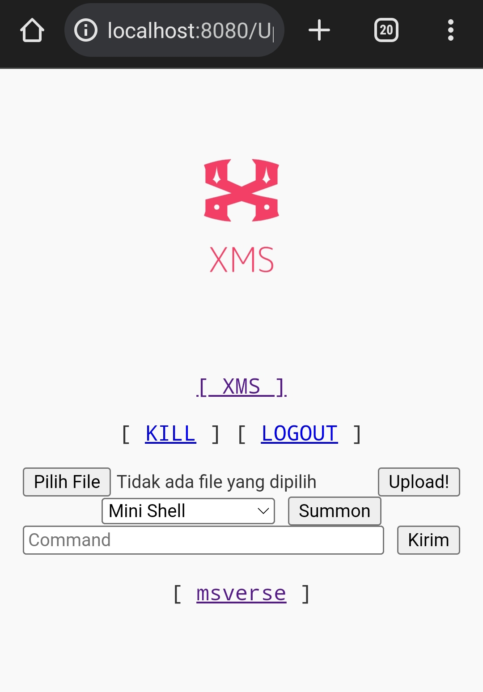
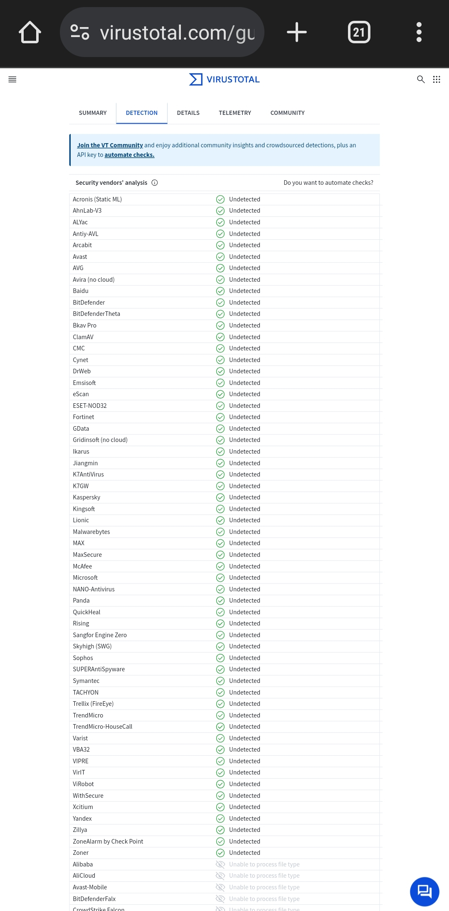

# XMS-Uploader
XMS Uploader adalah uploader yang memiliki sedikit fitur yang lebih bagus dibandingkan biasanya dikarenakan memiliki fitur Shell Summon & Anti Malware Scanner

# Informasi

# Tampilan
-------
 

# Fitur 
- Kill
- Logout
- Shell Summon
- Command Line

# Malware Scanner 
 
Ini yang versi XMSob.php

# Dukungan
[Click Me](https://www.msverse.site) 
Mampir ke blogku sudah cukup membantu. 

# Tanggung Jawab
Saya, sebagai pembuat script ini, dengan tegas menyatakan bahwa saya tidak bertanggung jawab atas penggunaan atau konsekuensi yang mungkin timbul dari penggunaan script ini.
