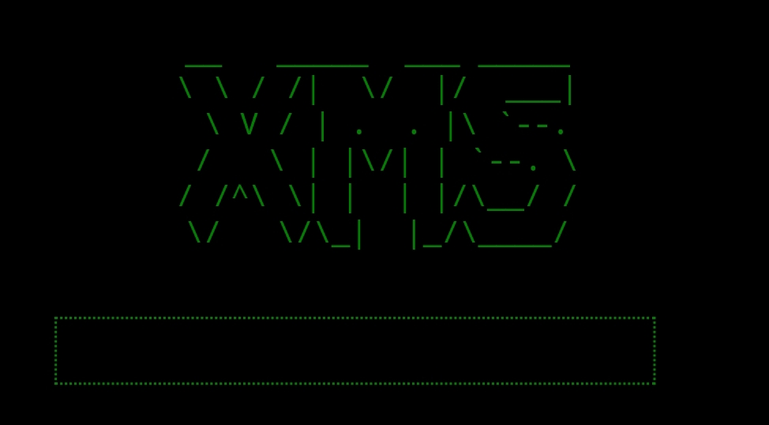

# XMS-Uploader
XMS Uploader is a PHP script designed for file uploads on a web server. Its main features include a login form, file upload functionality, a responsive user interface, and the ability to summon a shell using the file_get_contents() function.

# Information

# Preview
-------
 
- Password: XMS

 

# Feature
- Kill
- Logout
- Shell Summon
- Command Line
- Login form (password: XMS) 

# Malware Scanner 
 
Ini yang versi XMSob.php

# Support Me
[Click Me](https://www.msverse.site) 
Stopping by my blog is enough to help me.

# Responsibility
I, as the creator of this script, hereby declare that I am not responsible for the usage or any consequences that may arise from using this script.
